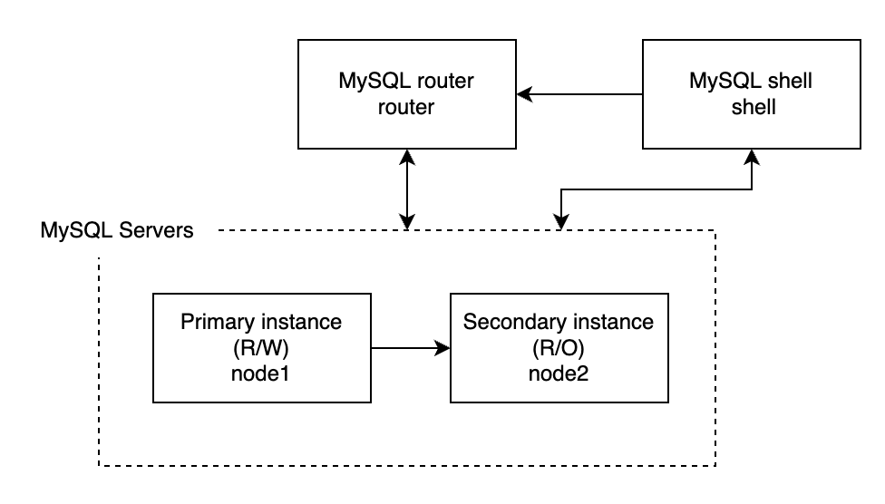

# README
## 目次
- [README](#readme)
  - [目次](#目次)
  - [このリポジトリの目的](#このリポジトリの目的)
  - [MySQL InnoDB Clusterについておさらい](#mysql-innodb-clusterについておさらい)
    - [一言でまとめると...](#一言でまとめると)
    - [構成](#構成)
    - [参考資料](#参考資料)
  - [MySQL InnoDB Clusterの構築](#mysql-innodb-clusterの構築)
    - [完成イメージ](#完成イメージ)
    - [このディレクトリの構成](#このディレクトリの構成)
    - [構築](#構築)
  - [リファレンス](#リファレンス)
## このリポジトリの目的
* MySQL InnoDB Clusterをとりあえず構築してみる
* 構築する際のコマンドの解説を聞いてMySQL系について知見を深めてみる
## MySQL InnoDB Clusterについておさらい
### 一言でまとめると...
少なくとも 3 つの MySQL Server インスタンスで構成されており、高可用性およびスケーリング機能を提供したもの
複数サーバでMySQLを構築するため、負荷分散や自動フェイルオーバーなどをしてくれる
### 構成
* Client App
  * Webサーバ
* MySQL Shell
  * 設定を行う事ができるエディタ(できることが超豊富にあり、これだけで題材にできそう)
* MySQL Router
  * 接続先の自動フェイルオーバー、ルーティングを提供
* Instance
  * nodeとなるサーバー達
  * シングルプライマリモード
    * Primary
      * 読み込み/書き込み が可能
    * Secondary
      * 読み込みのみ可能
  * マルチマスターモード
    * 全て 読み込み/書き込み が可能
### 参考資料
* [第三回山崎会資料](https://docs.google.com/presentation/d/1_WrgcIaJEacs6ZlL3I-_ZOm4l-31A6lOmC6opt27F-I/edit?usp=sharing)
* [MySQL公式ドキュメント](https://dev.mysql.com/doc/refman/8.0/ja/mysql-innodb-cluster-introduction.html)
## MySQL InnoDB Clusterの構築
### 完成イメージ
今回作成するのはシングルプライマリモード

### このディレクトリの構成
   ```
   $ tree
    .
    ├── README.md
    ├── docker-compose.yml
    └── docker-config
        ├── node
        │   └── Dockerfile
        ├── router
        │   └── Dockerfile
        └── shell
            └── Dockerfile

   ```
   1. docker-compose.yaml
      1. 各コンテナの作成
      2. ネットワークの作成
   2. Dockerfile
      1. 構築に必要なパッケージのインストール
### 構築
1. このリポジトリをclone
    ```
    $ git clone git@github.com:hidakakosuke/mysql-docker-compose-examples.git
    ```
2. ディレクトリ移動
   ```
   $ cd mysql-docker-compose-examples/
   ```
3. docker-composeでコンテナを立ち上げる
   ```
   $ docker-compose up -d
   ```
4. コンテナが立ち上がっていることを確認
   ```
    docker ps
    CONTAINER ID   IMAGE                       COMMAND        CREATED          STATUS          PORTS     NAMES
    3ecb9263cb49   innodb-cluster-own_node2    "/sbin/init"   16 seconds ago   Up 10 seconds             innodb-cluster-own-node2-1
    634f8a44bc78   innodb-cluster-own_node1    "/sbin/init"   16 seconds ago   Up 10 seconds             innodb-cluster-own-node1-1
    44dfcdbaeb32   innodb-cluster-own_router   "/sbin/init"   16 seconds ago   Up 10 seconds             innodb-cluster-own-router-1
    b33dbb5db9ad   innodb-cluster-own_shell    "/sbin/init"   16 seconds ago   Up 10 seconds             innodb-cluster-own-shell-1
   ```
5. nodeの設定
   1. コンテナに接続
      ```
      $ docker exec -it innodb-cluster-own-node1-1 /bin/bash
      ```
   2. mysqlに接続しユーザ作成
      ```
      [root@node1 /]# systemctl start mysqld
      [root@node1 /]# mysql

      mysql> create user 'root'@'172.30.0.%' identified by 'root';
      mysql> grant all on *.* to 'root'@'172.30.0.%' with grant option;
      ```
      1. `systemctl start mysqld`
         1. コンテナを立ち上げた段階ではmysqlが立ち上がってないので立ち上げる
      2. `create user 'root'@'172.30.0.%' identified by 'root'`
         1. ユーザーを新しく作成するためのコマンド
         2. CREATE USER 'ユーザ名'@'ホスト名' IDENTIFIED BY 'パスワード'
            1. ホスト名が`172.30.0.%`の理由
               1. 172.30.0から始まるIPアドレスからログインが可能という意味
      3. `grant all on *.* to 'root'@'172.30.0.%' with grant option;`
         1. 作成したユーザーに対して権限を付与
         2. `grant`
            1. ユーザーアカウントに権限を付与するコマンド
         3. `all`
            1. GRANT OPTION を除いた全ての権限
         4. `*.*`
            1. 全DBの全てのtable（[database].[table]）
         5. `to 'root'@'172.30.0.%'`
            1. 'root'@'172.30.0.%'ユーザーに
         6. `with grant option`
            1. GRANT OPTIONをオプションで付与
               1. GRANT OPTIONとは他人の権限も変更できてしまう最強のオプション
               2. root@localhostは最初にこの設定がなされている
   3. この設定をnode1, node2に対して行う
6. shellの設定
   1. コンテナに接続
      ```
      $ docker exec -it innodb-cluster-own-shell-1 /bin/bash
      ```
   2. MySQL Group Replication の各インスタンスの設定
      ```
      [root@shell /]# mysqlsh

      MySQL  JS > dba.configureInstance('root@node1')

      Please provide the password for 'root@node1': ****
      Save password for 'root@node1'? [Y]es/[N]o/Ne[v]er (default No): N
      Do you want to perform the required configuration changes? [y/n]: y
      Do you want to restart the instance after configuring it? [y/n]: y

      MySQL  JS > dba.configureInstance('root@node2')

      Please provide the password for 'root@node2': ****
      Save password for 'root@node2'? [Y]es/[N]o/Ne[v]er (default No): N
      Do you want to perform the required configuration changes? [y/n]: y
      Do you want to restart the instance after configuring it? [y/n]: y
      ```
      1. `mysqlsh`
         1. MySQL shellの起動コマンド
      2. `dba.configureInstance('root@node1')`
         1. インスタンスを InnoDB クラスタ の使用に使用できるようにするために必要なすべての設定をチェック
            1. インスタンスで構成の変更が不要な場合は、インスタンスの構成を変更する必要はなく、クラスタを使用する準備ができている旨が出力される
            2. インスタンスを InnoDB クラスタ と互換性を持たせるために変更が必要な場合は、互換性のない設定のレポートが表示され、コマンドでインスタンスオプションファイルを変更できる。
      3. (`dba.checkInstanceConfiguration('root@node1')`)
         1. `dba.configureInstance('root@node1')`は設定変更まで行うが、このコマンドは現状のクラスタの使用に必要な設定になっているかどうかを出力してくれるコマンド
   3. MySQL Group Replication のクラスターを組む
      ```
      MySQL  JS > \c root@node1
      MySQL  node1:33060+ ssl  JS > cluster = dba.createCluster('mycluster')
      MySQL  node1:33060+ ssl  JS > cluster.addInstance('root@node2')
      ```
      1. `\c root@node1`
         1. root@node1インスタンスに接続
      2. `cluster = dba.createCluster('mycluster')`
         1. myclusterという名前のクラスターを作成
         2. ここで`cluster = dba.createCluster('mycluster', { multiPrimary: true })`と入力するとマルチマスターモードでクラスターが作成される
      3. `cluster.addInstance('root@node2')`
         1. `mycluster`クラスターにroot@node2インスタンスを追加
   4. 作成したクラスターのstatusを確認
      ```
       MySQL  node1:33060+ ssl  JS > cluster.status()
       {
           "clusterName": "mycluster",
           "defaultReplicaSet": {
               "name": "default",
               "primary": "node1:3306",
               "ssl": "REQUIRED",
               "status": "OK_NO_TOLERANCE",
               "statusText": "Cluster is NOT tolerant to any failures.",
               "topology": {
                   "node1:3306": {
                       "address": "node1:3306",
                       "memberRole": "PRIMARY",
                       "mode": "R/W",
                       "readReplicas": {},
                       "replicationLag": "applier_queue_applied",
                       "role": "HA",
                       "status": "ONLINE",
                       "version": "8.0.26"
                   },
                   "node2:3306": {
                       "address": "node2:3306",
                       "memberRole": "SECONDARY",
                       "mode": "R/O",
                       "readReplicas": {},
                       "replicationLag": "applier_queue_applied",
                       "role": "HA",
                       "status": "ONLINE",
                       "version": "8.0.26"
                   }
               },
               "topologyMode": "Single-Primary"
           },
           "groupInformationSourceMember": "node1:3306"
       }
      ```
7. routeの設定
   1. コンテナに接続
      ```
      $ docker exec -it innodb-cluster-own-router-1 /bin/bash
      ```
   2. clusterを設定
      ```
      [root@router /]# mysqlrouter --bootstrap root@node1 --user=mysqlrouter

      ## MySQL Classic protocol

      - Read/Write Connections: localhost:6446
      - Read/Only Connections:  localhost:6447

      ## MySQL X protocol

      - Read/Write Connections: localhost:6448
      - Read/Only Connections:  localhost:6449
      ```
      1. `mysqlrouter --bootstrap root@node1 --user=mysqlrouter`
         1. `--bootstrap root@node1`
            1. クラスタを構成しているインスタンスの内のどれかを選択
               1. root@node2でも可
         2. `--user=mysqlrouter`
            1. mysqlrouterに接続するユーザを指定
               1. mysqlrouterはデフォルトユーザ
      2. ポートについて
         1. Read/Write : localhost:6446
         2. Read/Only  : localhost:6447
      3. MySQL Classic protocol？ MySQL X protocol？
         1. 正直調べてみたがあまりわからず...
         2. 通常のアクセスはMySQL Classic protocolを使用しているらしい
   3. routerを再起動
      ```
      [root@router /]# systemctl start mysqlrouter
      ```
8. `mysql`コマンドが使えるサーバーなら何処でもいいので接続確認
   ```
   [root@node2 /]# mysql -u root -p -h router -P 6446
   mysql> select @@hostname;
   +------------+
   | @@hostname |
   +------------+
   | node1      |
   +------------+
   1 row in set (0.01 sec)

   [root@node2 /]# mysql -u root -p -h router -P 6447
   mysql> select @@hostname;
   +------------+
   | @@hostname |
   +------------+
   | node2      |
   +------------+
   1 row in set (0.00 sec)
   ```
## リファレンス
* [MySQL InnoDB Cluster練習](https://blog.katsubemakito.net/mysql/mysql-update-error-gpg)
* [6.2.2.1 新しい本番 InnoDB クラスタ のデプロイ](https://docs.oracle.com/cd/E17952_01/mysql-shell-8.0-ja/deploying-new-production-cluster.html)
* [MySQL Routerを使用して、InnoDB Clusterを構成する（MySQL Routerの設定主体）](https://kazuhira-r.hatenablog.com/entry/2019/08/31/012059)
* [公式ドキュメント：InnoDB クラスタ の構成](https://dev.mysql.com/doc/mysql-shell/8.0/ja/configuring-innodb-cluster.html)